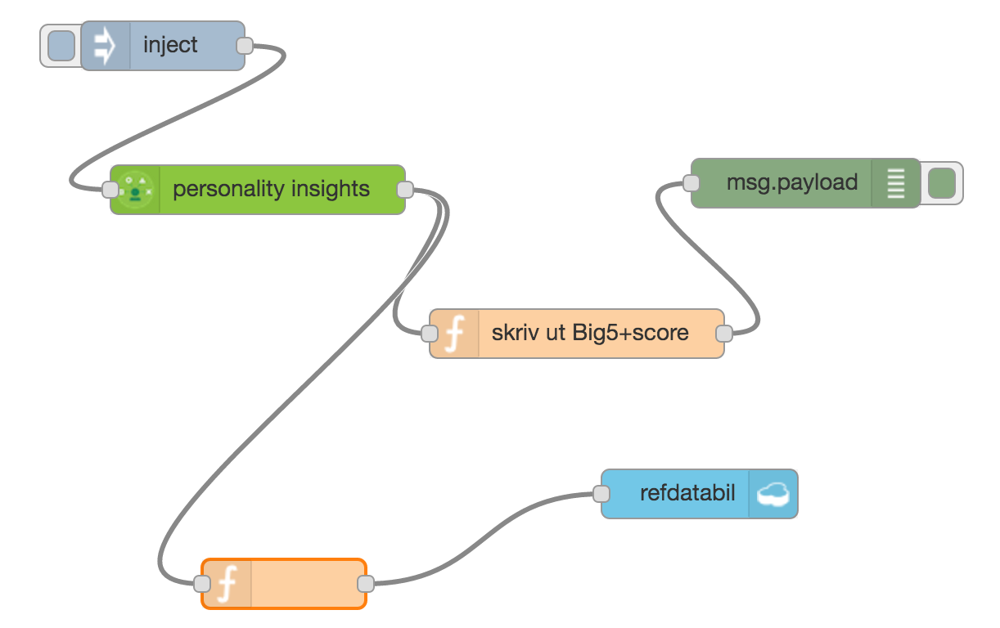
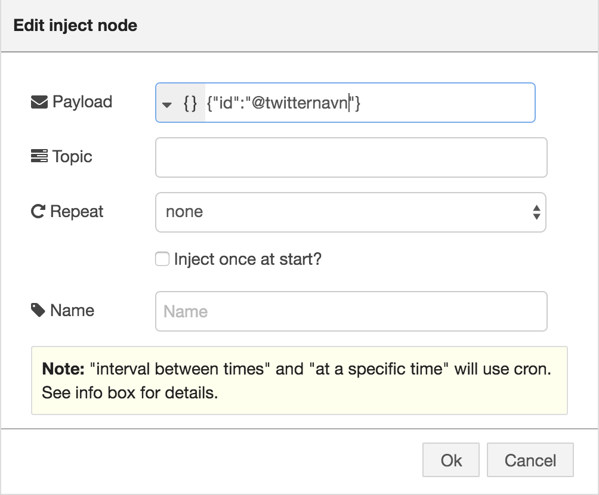

<h1>Bluemix oppgave MøllerGruppen</h1>

<h1>Oppgave 1 </h1>


Denne oppgaven tar utgangspunkt i en Watson tjeneste som kan benyttes for å gjøre en personlighets analyse av tekst. Mer om tjenesten her: http://www.ibm.com/smarterplanet/us/en/ibmwatson/developercloud/personality-insights.html

Tanken er følgende. Bruk noe tekst input om en av deres kunder (feks twitter feeds) send de til watson for analyse. Etabler en referanse database med møllers biler knyttet mot personlige egenskaper (Big 5). Sammenstill analysen fra watson med databasen og finn hvilken møller bli som passer.

Dere står helt fritt till hvordan dere ønsker å løse denne oppgaven - om dere vil kode i java, js eller stiften den sammen i feks Node-Red.

Jeg har to eksempler her - en hvor vi bygger dette opp som en prototype i Node-Red og siden bygger en node.js app med et enkelt gui.


- Opprett en konto på Bluemix - hvis du ikke allerede har  http://Bluemix.net - sign-up.
- Opprett en ny app basert på en Node-Red Starter Boilerplate.
- Følg steg i «getting started» - last ned CF tool og starter code ( den trenger vi senere da vi skal endre litt på oppsettet av node-red).
- Legg en Watson Personal insights service til appen din ved å gå på connections fanen - connect new - finn en watson peronal insights service og bekreft re-stage av appen.
- Når Node-red har startet gå til url du valgte som app navn.
- La oss lage en enkel flow for å teste ut tjenesten.
- Velg en watson peronality insights node fra paletten på venstre side.
- Legg til en inject node + en debug node og koble dem sammen slik


- Endre debug noden til å logge msg.insights

- Finn noe engelsk tekst feks http://time.com/4267058/donald-trump-aipac-speech-transcript/
- Copy paste teksten in i inject noden din (som string) - kjør flowen ved å trykke inject knappen.
- Får du et object ut i debug vinduet til høyere ? Dette er hele objektet, det vi skal bruke er bare BIG 5 delen
- La oss lage et filter som bare skriver ut de vi skal bruke.
- Velg en function node og lag en funksjon som dette:

  var score = msg.insights.children[0].children[0].children;
  var allscore = [];
      score.forEach(function(item){
          allscore.push(item.name+':'+item.percentage);
          });    
  msg.payload=allscore;          
  return msg;

- Endre debug noden din tilbake til å logge msg.payload
- Test flowen - du skal se de fem kategoriene vi skal bruke i denne oppgaven.
- La oss på enkleste måte bygge en referanse base. Velg en Coudant out put node og skriv hele insigth objectet dit.
- Lag en funksjon som putter msg.insights over i msg.payload ( msg.payload = msg.instights;
return msg;) og velg i cloudant noden "store only payload object"



- Test flow - se at du for et object over i cloudant basen din. Du finner gui på den under connections fanen i appen din (bluemix gui). Kjør flowen noen ganger slik at vi får flere dokumenter i basen.
- Gi navn på de ulike dokumentene i basen ved å endre "name": «root» til feks «name»:»A5»
- Det neste vi trenger er en funksjon som finner det dokumentet som er mest likt det svaret du får fra watson.
- Tanken er å lage en function som tar msg.insights fra watson noden - gjør et call til cloudant for å hente alle documentene kjøre en matte funksjon som sammenligner BIG 5 og lager en liste basert på score. Til det trenger jeg et kall mot cloudant - velger nå å gjøre det med et rest call rett mot basen - og en matte funksjon som gjør scoring jobben. Math.pow og Math.sqrt gjør jobben.
- For rest called ønsker jeg å bruke request og da må det legges til i prosjectet og enables for node red. Dette gjøres vel å oppdatere package.json legg til "express":"4.x" under dependencies og oppdater bluemix-settings.js
```javascript
  // bluemix-settings.js

  functionGlobalContext: {
    request:require('request'),
    express:require('express'),
    util:require('util'),
    twit:require('twit'),
    bodyParser:require('body-parser'),
    googleTranslate:require('google-translate')
      }
    // la til noen til vi trenger senere i oppgaven

  // package.json

  "dependencies": {
  ........
    "request":"2.x",
    "twit":"2.x",
    "body-parser":"1.x",
    "google-translate":"1.x",
    "express":"4.x"
    }
```
- Nå kan global context hentes ved "global.get('request')" i node red. Husk å push applikasjonen til bluemix!
- cf push appname
- En function som sammenligner data fra watson med det du har i basen - kan se noe slikt ut:
```javascript
var user = msg.insights;
var resarray = [];
var cars;
var request = global.get('request');
var getCars = function(callback){ // denne henter dokumentene fra cloudant...
var url = 'URL to cloudant/databasename/_all_docs?include_docs=true';
  request({
    url: url,
    json: true },
    function (error, response, body) {
    if (!error && response.statusCode == 200) {
        console.log("from cloudant"+body);
      callback(null,body);
    } else {
      callback(error);
    }
  })
}
getCars(function(err, result){
    if(err){
      console.log("Error " + JSON.stringfy(err));
    } else { // hvis vi får tilbake et ogject fra cloudant løper vi igjennom det og sender det til similar funksjonen.
     result.rows.forEach(function(item) {
     console.log("detter er item: "+item.doc.name);
     similar(user, item.doc);
      });
      console.log("all done : " + JSON.stringify(resarray));
      resarray.sort(function(a,b){return b.Score - a.Score});
      msg.payload = JSON.stringify(resarray);
      node.send(msg);
    }
  });
// Dette gjør sammenligningen av de fem verdiene
function similar (origin,target) {
  origin = typeof(origin) === 'string' ? JSON.parse(origin) : origin;
  target = typeof(target) === 'string' ? JSON.parse(target) : target;
  var distance = 0.0,
    origin_traits = origin.children[0].children[0].children,
    target_traits = target.children[0].children[0].children;
    //console.log("user:" + origin.length);
    //console.log("car:" + target_traits.length);
    // for each trait in origin personality...
  origin_traits.forEach(function(trait, i) {
      console.log("used categories: " + trait.name+":"+trait.percentage);
    distance += Math.pow(trait.percentage - target_traits[i].percentage, 2);
  });
  var ret = 1 - (Math.sqrt(distance / origin_traits.length));
  msg.payload = {"Score":ret,"Merke": target.name,"Model":target.id,"DocId":target._id};
  resarray.push(msg.payload);
  //node.send(msg);
  return resarray;
}
return msg;
```


- Lag function noden og test flowen. OK ?
- Neste nå er å hente tekst fra twitter….
- En måte er å bare bruke en npm modul som heter Twit…  Den må legges til i package.json og blumix-settings.js
- Du trenger også consumer og access key fra twitter. Gå på twitter dev og lag en app - generer key's.
- Klipp ut og lim dem inn i en function node.

``` javascript
var express = global.get('express'),
    app = express(),
    extend = global.get('util')._extend,
    Twit = global.get('twit');
var bodyParser = global.get('bodyParser');
    app.use(bodyParser.json()); // support json encoded bodies
    app.use(bodyParser.urlencoded({ extended: true })); // support encoded bodies

// Twitter connection variables - go twitterdev to optain key's
var tweet = new Twit({
    consumer_key: '<>',
    consumer_secret: '<>',
    access_token: '<>',
    access_token_secret: '<>'
});

var query = msg.payload.id;
var options;
var tpath;
var tpush;

console.log("Got request for tweets on : " + query);
    options = {
        screen_name: query,
        count: 200,
        include_rts: false
        };
    tpath = 'statuses/user_timeline';
    var tweets = [];
    // Send a get to the Twitter API to retrieve a specifice user's timeline
   tweet.get(tpath, options, function(err, data) {
        if (err) {
            console.log("Something went wrong with twitter api: " + err);
        }else{
        	// Loop through and add tweets to an array
        	for (var i = 0; i<data.length; i++){
        		tweets.push(data[i].text);
        	}
        }
    console.log("Returning tweets" +tweets );
        msg.payload = JSON.stringify(tweets);
    node.send(msg);
 }); // End tweet.get
```
- Lag en input node hvor du sender in {«id»:»@twitternavn»} som JSON



- Test flow og se du får tweets tilbake som tekst. Send den til watson og se om flowen virker.
- Watson personality virker bare på engelsk og spansk for tiden - det er jo enkelt å bruke google til oversetting fra norsk til engelsk…

```javascript
var googleTranslate = global.get('googleTranslate')('<get key from google>');
var transtweet = [];
googleTranslate.translate(msg.payload, 'no', 'en', function(err, translations) {
          if(err){
            console.log("obs something wrong at Google... " + err);
          }else{
          for (var i =0; i<translations.length; i++){
            transtweet.push(translations[i].translatedText);
            }
            msg.payload=JSON.stringify(transtweet);
            node.send(msg);
          }
});

```


- Nå skal du ha en komplett flow som henter tweets - sender de til watson - sammenligner resultatet med referanse databasen - og printer er liste med scores mot de modellene du har der. Du kan prøve å endre på dataene dine i databasen slik at du får treff på mot en bil spesiell bil… Du har jo allerede skrevet ut kategoriene... Finn de i dokumentet og endre på tallene...

- <a href="/flows/flow1.json">Du finner hele flowen her..</a>


<h1>Oppgave 2</h1>

Her skal vi sette opp "løsningen" med et GUI i node.js
Du trenger node.js, npm, git lokalt på maskinen din. Eller du kan bruke IBM DevOps Services på nett.
Jeg tror det er et relevant eksemple å ha koden kjørende lokalt og push over til bluemix når du ser alt virker greit. Men som nevnt du kan gjøre alt fra DevOps Services - noe som blir forklart til slutt.

Hvis du har node,npm og git lokalt start slik.

- Set opp et localt git ( git init ...)
- Last ned denne <a href="/nodeJSkode/oppgave2.zip">zip filen.....</a> unzip in i det nye gitet du har laget.
- I root katalogen kjører du 'npm install'
- Editer app.js med google key, twitter, cloudant url og database navn. (fra oppgave 1)
- Kjør appen lokalt (node app.js) - prøv med en browser på http://localhost:3000
- Nå bør det virke og du er nå klar til å dytte dette over til Bluemix.
- Legg til alle filene i det nyoprettede git - gitt add *
- Opprett et prosjekt i DevOps Services. https://hub.jazz.net - samme bruker som i bluemix.
- Velg et navn og trykk på create new repository - git repro on Bluemix.
- Noter deg git url og bruk default settings på resten.
- Push innholdet av din locale git opp til Bluemix.
- git remote add origin <din git url>
- git push origin master
- Nå skal du se ditt prosjekt i DevOps med din locale kode hvis du trykker på edit code knappen.
- Nå skal vi bygge en pipeline for å deploye koden til to ulike blumix miljøer(dev + prod) du kan velge om det skal være på to siter eller i to forskjellige spaces...
- Trykk på Build&Deploy knappen i DevOps konsollet.
- Trykk på add Stage - gi stage navn 'Dev'
- Input bør være riktig satt opp med peker på gir reproe ditt.
- Trykk på jobb fanen og add jobb - Deploy
- Velg et target miljø og gi appen et navn feks espensdev
- Deployscripet må tilpasses litt for å også sette opp watson tjenesten.(For Cloudant bruker vi den fra oppgave 1 bare for å spare litt tid i oppgaven - vi kunne selvsagt satt opp en ny og replikert over test data)    
- Deploy script
```javascript
#!/bin/bash
cf cs personality_insights tiered tweetmewatson-pi-mo
cf bs "${CF_APP}" tweetmewatson-pi-mo 
# -n = navn og -d = domain mybluemix.net for US og eu-gb.mybluemix.net for UK
cf push -n "espensdev" -d "mybluemix.net" "${CF_APP}"  
```
- Du kan kjøre Stage ved å trykke på play knappen eller gjøre en ny commit/push av koden fra lokalt repro.
- Det er jo som dere sikkert ser mange muligheter hvordan bygge deploy rundt dette.
- Utvid med et Stage til og deploy det til et annet space eller site.
- Jeg antar at dere nå forstår hvordan dere kan gjøre hele jobben i DevOps Services!
- Hvis ikke - opprett et prosjekt i DevOps. Gå til Edit Code og kopier in filene fra zip filen
- Editer app.js med de samme nøkklene ( google,twitter,cloudant).
- Bygg pipeline.....
