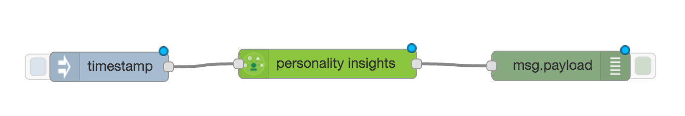

Bluemix oppgave MøllerGruppen


Denne oppgaven tar utgangspunkt i en Watson tjeneste som kan benyttes for å gjøre en personlighets analyse av tekst. Mer om tjenesten her: http://www.ibm.com/smarterplanet/us/en/ibmwatson/developercloud/personality-insights.html

Tanken er følgende. Bruk noe tekst input om en av deres kunder (feks twitter feeds) send de til watson for analyse. Etabler en referanse database med møllers biler knyttet mot personlige egenskaper (Big 5). Sammenstill analysen fra watson med databasen og finn hvilken møller bli som passer.

Dere står helt fritt till hvordan dere ønsker å løse denne oppgaven - om dere vil kode i java, js eller stiften den sammen i feks Node-Red.

Jeg har to eksempler her - en hvor vi bygger dette opp som en prototype i Node-Red og siden bygger en node.js app med et enkelt gui.


- Opprett en konto på Bluemix - hvis du ikke allerede har  http://blumix.net - sign-up.
- Opprett en ny app basert på en Node-Red Starter Boilerplate.
- Følg steg i «getting started» - last ned CF tool og starter code ( den trenger vi senere da vi skal endre litt på oppsettet av node-red.
- Legg en Watson Personal insights service oil happen din ved å gå på connections fanen - connect new. Bekreft re-stage av app.
- Når Node-red har startet gå til url du valgte som app navn.
- La oss lage en enkel flow for å teste ut tjenesten.
- Velg en watson peronality insights node fra paletten på venstre side.
- Legg til en inject node + en debug node og koble dem sammen slik



- Endre debug noden til å logge msg.insights

- Finn noe engelsk tekst feks http://time.com/4267058/donald-trump-aipac-speech-transcript/
- Copy paste teksten in i inject noden din - kjør flowen ved å trykke inject knappen.
- Får du et object ut i debug vinduet til høyere ? Dette er hele objektet, det vi skal bruke er bare BIG 5 delen
- La oss lage et filter som bare skriver ut de vi skal bruke.
- Velg en function node og lag en funksjon som dette:

  var score = msg.insights.children[0].children[0].children;
  var allscore = [];
      score.forEach(function(item){
          allscore.push(item.name+':'+item.percentage);
          });    
  msg.payload=allscore;          
  return msg;

- Endre debug noden din tilbake til å logge msg.payload
- Test flowen - du skal se de fem kategoriene vi skal bruke i denne oppgaven.
- La oss på enkleste måte bygge en referanse base. Velg en Coudant out put node og skriv hele insigth objectet dit.
- Lag en funksjon som putter msg.insights over i msg.payload ( msg.payload = msg.instights;
return msg;) og velg i cloudant noden "store only payload object"


- Test flow å se du for et object over i cloudant basen din. Du finner gui på den under connections fanen i appen din (bluemix gui). Kjør flowen noen ganger slik at vi får flere dokumenter i basen.
- Gi navn på de ulike dokumentene i basen ved å endre "name": «root» til feks «name»:»A5»
- Det neste vi trenger er en funksjon som finner det dokumentet som er mest likt det svaret du får fra watson.
- Tanken er å lage en function som tar msg.insights fra watson noden - gjør et call til cloudant for å hente alle documentene kjøre en matte funksjon som sammenligner BIG 5 og lager en liste basert på score. Til det trenger jeg et kall mot cloudant - velger nå å gjøre det med et rest call rett mot basen - og en matte funksjon som gjør scoring jobben. Math.pow og Math.sqrt gjør jobben.
- For rest called ønsker jeg å bruke request og da må det legges til i prosjectet og enables for node red. Dette gjøres vel å oppdatere package.json legg til "express":"4.x" under dependencies og oppdater bluemix-settings.js
```javascript
  // bluemix-settings.js

  functionGlobalContext: {
    request:require('request'),
    express:require('express'),
    util:require('util'),
    twit:require('twit'),
    bodyParser:require('body-parser'),
    googleTranslate:require('google-translate')
      }
    // la til noen til vi trenger senere i oppgaven

  // package.json

  "dependencies": {
  ........
    "request":"2.x",
    "twit":"2.x",
    "body-parser":"1.x",
    "google-translate":"1.x",
    "express":"4.x"
    }
```
- Nå kan global context hentes ved "global.get('request')" i node red. Husk å push applikasjonen til bluemix!
- cf push appname
- En function som samenligner data fra watson med det du har i basen kan se noe slikt ut:
```
var user = msg.insights;
var resarray = [];
var cars;
var request = global.get('request');
var getCars = function(callback){
var url = 'URL to cloudant/databasename/_all_docs?include_docs=true';
  request({
    url: url,
    json: true },
    function (error, response, body) {
    if (!error && response.statusCode == 200) {
        console.log("from cloudant"+body);
      callback(null,body);
    } else {
      callback(error);
    }
  })
}
getCars(function(err, result){
    if(err){
      console.log("Error " + JSON.stringfy(err));
    } else {
     result.rows.forEach(function(item) {
     console.log("detter er item: "+item.doc.name);
     similar(user, item.doc);
      });
      console.log("all done : " + JSON.stringify(resarray));
      resarray.sort(function(a,b){return b.Score - a.Score});
      msg.payload = JSON.stringify(resarray);
      node.send(msg);
    }
  });
// Dette gjør sammenligningen av de fem verdiene
function similar (origin,target) {
  origin = typeof(origin) === 'string' ? JSON.parse(origin) : origin;
  target = typeof(target) === 'string' ? JSON.parse(target) : target;
  var distance = 0.0,
    origin_traits = origin.children[0].children[0].children,
    target_traits = target.children[0].children[0].children;
    //console.log("user:" + origin.length);
    //console.log("car:" + target_traits.length);
    // for each trait in origin personality...
  origin_traits.forEach(function(trait, i) {
      console.log("used categories: " + trait.name+":"+trait.percentage);
    distance += Math.pow(trait.percentage - target_traits[i].percentage, 2);
  });
  var ret = 1 - (Math.sqrt(distance / origin_traits.length));
  msg.payload = {"Score":ret,"Merke": target.name,"Model":target.id,"DocId":target._id};
  resarray.push(msg.payload);
  //node.send(msg);
  return resarray;
}
return msg;
```


- Lag function noden og test flowen. OK ?
